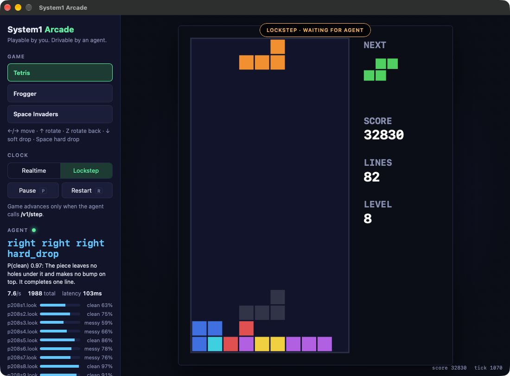
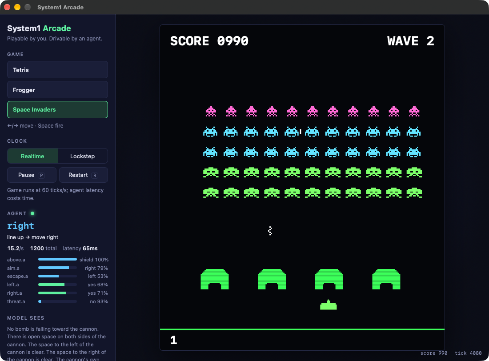
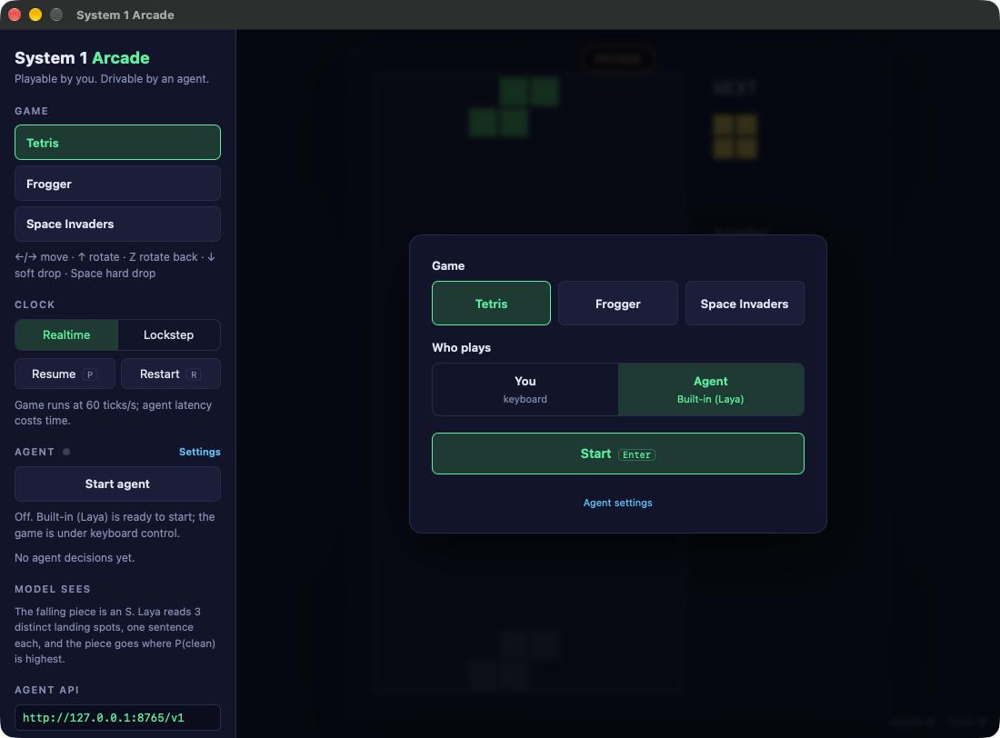
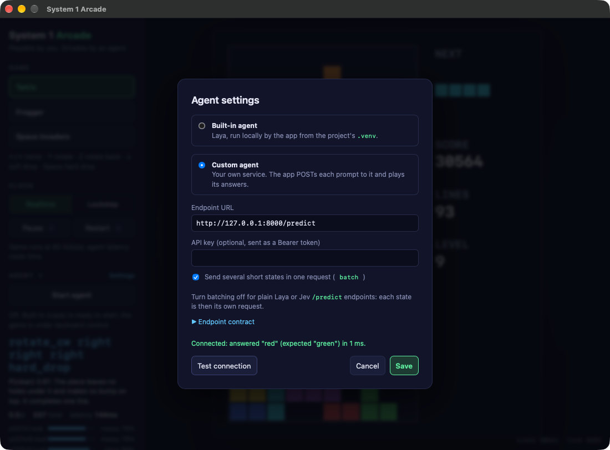

# System 1 Arcade

Tetris, Frogger and Space Invaders as a desktop app for experimenting with **System 1 decision
models**, such as the open-weights [Laya](https://huggingface.co/convaiinnovations/laya) and TypeSafe's
Jev. These models don't generate text. They take a short state and typed questions, and return
calibrated probabilities in one fast forward pass. Each game is playable with the keyboard, and an
agent plays it through the same virtual controller a person uses.

Built with Go and [Wails](https://wails.io), so it runs on macOS, Windows and Linux.

| Tetris | Frogger | Space Invaders |
|---|---|---|
|  |  |  |
| Lockstep: 442 lines, level 44 | Realtime: cleared levels 1 and 2 without losing a life | Realtime: cleared wave 1 |

In each screenshot, Laya is the player. The side panel shows its latest decision, its answer to each
question, and the plain-English description it was given ("Model sees").

## Quick start

You need Go, Node.js, the Wails CLI and, for the built-in agent, Python 3.

```sh
go install github.com/wailsapp/wails/v2/cmd/wails@latest
python3 -m venv .venv && .venv/bin/pip install laya   # built-in agent; downloads the model on first use
wails build                                          # → build/bin/System 1 Arcade.app
open "build/bin/System 1 Arcade.app"                 # or: wails dev
```

The app opens paused on a start screen. Pick a game, choose who plays (**You** or **Agent**) and
press **Start**. With the agent selected, the game stays paused until the agent's first answer,
because loading the model takes a few seconds.



Keys: arrows or WASD to move, ↑ to rotate or hop, Z to rotate back, Space or X to fire or hard drop,
Enter to restart after a game over, P to pause, R to restart.

## How an agent plays

Every decision is one round trip:

1. The game describes what a player would see as **short plain-English states**, each with a typed
   question.
2. The agent answers with probabilities.
3. The game turns the answers into button presses: taps and holds on the same virtual controller
   as the keyboard.

```
game ──"A bomb is falling straight at the cannon and will hit it in 0.4 seconds."──▶ model
     ◀──────────────── threat: yes ──────────────────────────────────────────────────
     ──▶ press left for 6 ticks
```

What made Laya play well, learned by measuring its answers against a perfect "oracle":

- **The game does the arithmetic and gives conclusions in words.** Laya can't count or compare
  numbers. "A car will drive through that square in 0.3 seconds, so the frog would be hit" works;
  `dx: -3, dy: 40` does not.
- **One short state per question.** Laya reads a single sentence far more reliably than a paragraph
  of facts. Games send several short states at once as a batch.
- **Options repeat the state's own words.** "What is directly above the cannon? an invader / empty
  space / the cannon's own shield" was answered correctly in all 400 test states. "Would a shot fired
  now hit an invader?" got "no" even when an invader was lined up.
- **The game holds the strategy; the model reads the situation.** Each game's `Decide` turns the
  answers into a plan, for example "dodge the bomb, else fire if an invader is above, else line up".

### What each game asks

| Game | States and questions per decision | How answers become input |
|---|---|---|
| **Tetris** | One sentence per distinct landing spot ("The piece leaves no holes under it and makes a small bump on top. It completes one line."), asked *clean or messy?* | The piece goes to the spot with the highest P(clean): rotate, shift and hard drop, one tap per tick |
| **Frogger** | One sentence per move ("Hopping up lands in a deadly place: a square a car will drive through in 0.3 seconds") asked *safe or deadly?*, plus where the nearest empty home is | Hop toward the goal if it's safe, else wait if staying is safe, else take the safest move |
| **Space Invaders** | Whether a bomb is about to hit, which way is open, whether each side is safe, what is directly above the cannon, where the next target is | Dodge, else fire when an invader is above, else slide toward the target (it leads moving targets) |

Situations are predictive where it matters. Frogger checks whether a square stays safe for the next
0.4 seconds, not just right now, and Space Invaders aims where the invader will be when the shot
arrives.

## Clocks: realtime and lockstep

- **Realtime** runs at 60 ticks per second whether or not the agent keeps up, like a person playing.
  The agent asks, waits for its answer, acts, and asks again, so its speed sets the pace. Laya on
  an Apple M4 Pro answers in about 65–120 ms, or 8–15 decisions per second.
- **Lockstep** freezes the game until the agent decides, then advances just enough to carry out the
  decision. Thinking time is free, so it measures decision quality alone, and the same seed and
  answers always replay the same game.

Switch with the **Clock** toggle in the side panel, or `POST /v1/mode`.

## Agents

Open **Settings** from the side panel or the start screen to choose the agent.



### Built-in agent

The app runs Laya locally as `agents/laya_server.py`, using the project's `.venv` Python. The app
finds the project folder from its own location; set `SYSTEM1_ROOT` if it can't.

### Custom agent

Point the app at your own HTTP service. For every decision the app POSTs a prompt and plays the
answers:

```
POST <url>
{"state": "Hopping up lands in a safe place: clear road with no traffic coming, which is safe.",
 "questions": {"a": {"type": "choice", "instructions": "What kind of place is it?",
                     "criteria": {"safe": "a safe place", "deadly": "a deadly place"}}}}

→ {"answers": {"a": {"type": "choice", "choice": "safe", "probabilities": {"safe": 0.98, "deadly": 0.02}}}}
```

- A single-state request is the same shape Laya's and Jev's predict endpoints take.
- Answers are `choice` (`choice`, `probabilities`), `noul` (`noul` = P(yes)) or `score`.
- When a decision has several states, the app sends `{"batch": {key: {state, questions}}}` and
  expects answers keyed `"key.question"`. Turn off **Send several short states in one request** for
  endpoints that only take single states, and the app sends one request per state instead.
- An optional API key is sent as a Bearer token. **Test connection** checks the endpoint before
  you save.

[`agents/custom_agent_example.py`](agents/custom_agent_example.py) is a standard-library starting
point: replace its `decide()` with your model.

```sh
python3 agents/custom_agent_example.py --port 8000   # then set http://127.0.0.1:8000/predict
```

### Agents that drive the game themselves

The app also serves a local API on `127.0.0.1:8765` (set `SYSTEM1_ADDR` to change it), so an agent
can pull prompts and push decisions on its own schedule. `agents/laya_agent.py` does this from a
terminal:

```sh
.venv/bin/python agents/laya_agent.py --game frogger -v                 # realtime
.venv/bin/python agents/laya_agent.py --game tetris --lockstep -v       # the game waits for each decision
.venv/bin/python agents/laya_agent.py --game invaders --policy oracle   # perfect answers: the ceiling
```

| Method | Path | Body | Notes |
|---|---|---|---|
| GET | `/v1/games` | | ids, titles, controls and actions |
| POST | `/v1/load` | `{game, seed?}` | switch game; seed 0 picks one |
| POST | `/v1/reset` | `{seed?}` | restart the current game |
| POST | `/v1/pause` | `{paused?}` | omit `paused` to toggle |
| POST | `/v1/mode` | `{mode}` | `realtime` or `lockstep` |
| GET | `/v1/laya` | | the prompt: `{state, questions}` or `{batch}` |
| POST | `/v1/decide` | `{answers, meta?}` | the game acts on the answers; in lockstep it also advances and returns the new state |
| GET | `/v1/oracle` | | the game's own correct answers to the current prompt |
| GET | `/v1/state` | | status, tick, seed, mode and a structured observation |
| GET | `/v1/frame` | | the current draw list |
| POST | `/v1/action` | `{action, hold_ticks?, hold_ms?, meta?}` | low-level: press a named action |
| POST | `/v1/press` | `{buttons, hold_ticks?}` | low-level: press raw buttons (`left right up down a b start`) |
| POST | `/v1/step` | `{action?, ticks?, meta?}` | low-level lockstep: act and advance |
| GET | `/v1/stream?every=N` | | Server-Sent Events of the state every N ticks |

## Measuring an agent

- **Oracle.** Every game can answer its own questions perfectly from its true internal state
  (`GET /v1/oracle`, `--policy oracle`). If the oracle scores low, the game's descriptions or
  decision logic are wrong. If the oracle scores high but the model doesn't, the model is misreading
  the descriptions.
- **Per-question accuracy.** `agents/eval_questions.py` plays with the oracle and compares the
  model's answer to every question, printing the sentences it gets wrong:

  ```sh
  .venv/bin/python agents/eval_questions.py --game frogger --api http://127.0.0.1:8799/v1
  ```
- **Headless runs.** `go run ./cmd/headless -addr 127.0.0.1:8799` serves the same API without a
  window, for benchmarks and CI.
- **Screenshots.** `scripts/screenshot.sh` captures the app window; see
  [docs/screenshots.md](docs/screenshots.md).

## Project layout

| Path | What |
|---|---|
| `internal/game` | the `Game` interface, virtual buttons, draw lists, and the `Advisor` interface (prompt → answers → decision) |
| `internal/games/{tetris,frogger,invaders}` | the games and their advisors |
| `internal/engine` | fixed 60 Hz loop, merging keyboard and agent input, realtime and lockstep, decision queue |
| `internal/agent` | the client and loop that play a game with an HTTP decision endpoint |
| `internal/api` | the local `/v1` HTTP API |
| `app.go`, `agent.go`, `main.go`, `frontend/` | the Wails desktop app: canvas renderer, start screen, settings, agent panel |
| `cmd/headless` | the engine and API without a window |
| `agents/` | built-in Laya server, terminal agent, custom agent example, batching helper, accuracy tool |

To add a game, implement `game.Game` (and `game.Advisor` for agents) and register it in
`internal/games/registry.go`.

```sh
go test ./internal/...   # includes an oracle-ceiling test for every game
```

## Known limitations

- Laya's Tetris play varies from game to game. Some seeds run for hundreds of lines; others top out
  early.
- Frogger's safety window doesn't yet account for decision latency, which costs lives once traffic
  speeds up on level 3.
- Space Invaders loses lives that perfect answers avoid; the oracle reaches waves 7–10.
- The built-in agent runs from the project folder and its `.venv`, so a copied `.app` needs a custom
  agent or `SYSTEM1_ROOT`.
- Windows and Linux builds haven't been tested yet.
