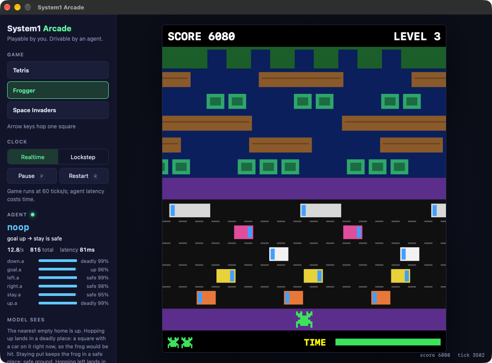

# Frogger



## Gameplay

Guide the frog across a road and a river into the five homes at the top.

- **The field**, 13 columns by 13 rows, from the bottom:
  - the start row (safe),
  - five road lanes of cars and trucks, each at its own speed and direction,
  - the middle strip (safe),
  - five river lanes of logs and turtles,
  - the bank, with five homes (columns 3, 5, 7, 9 and 11).
- **Controls:** the arrow keys hop one square. After a hop the frog can't hop again for 8 ticks
  (about 0.13 s).
- **Riding:** in the river the frog must stand on a log or turtles and drifts along with it.
- **Dying:** being hit by a vehicle, landing in water, being carried off the screen, landing on the
  bank between homes or in a filled home, or running out of time (30 seconds per frog). The frog
  has 3 lives.
- **Scoring:** 10 points for each row closer to the homes than the frog has been this life; 50
  points plus 10 per second left for reaching a home. Filling all five homes scores 1,000, starts
  the next level, where every lane moves faster (by 15% of its starting speed per level).

## What the agent is asked

Each decision asks where the frog can safely go and where it should head. The game sends six short
states, each with one question.

### Five moves: safe or deadly?

For each move (up, stay, left, right, down) the game works out where the frog would land and what
will happen there, then states the verdict in words:

> Hopping up lands in a deadly place: a square a car will drive through in 0.3 seconds, so the frog
> would be hit.
>
> Hopping left lands in a safe place: a log the frog can ride safely.
>
> Staying put keeps the frog in a safe place: safe ground.
>
> Hopping down lands in a deadly place: the bottom edge, where the frog cannot go.

| Landing on | Safe or deadly |
|---|---|
| road | deadly if a vehicle is there or will drive through soon (with its timing); otherwise "clear road with no traffic coming" |
| river | safe on "a log (or turtles) the frog can ride safely"; deadly for open water, the end of a log drifting away, or a log carrying the frog off the screen |
| the bank | safe for an empty home; deadly for a filled home or the bank between homes |
| start row or middle strip | safe ground |
| off the field | deadly: "the edge, where the frog cannot go" |

"Soon" means the square must stay safe from the moment the frog lands until it can move again.
That is at least 0.4 seconds, longer at slower agent input speeds. At slower speeds the hop can
also happen a few ticks after the decision, so the game checks the square at the time the frog
will land, including how far it drifts on its current log before hopping.

Each of these states gets the same question, whose options repeat the state's words:

```json
{"type": "choice", "instructions": "What kind of place is it?",
 "criteria": {"safe": "a safe place", "deadly": "a deadly place"}}
```

### Where to head

> The nearest empty home is up.
>
> The nearest empty home is to the right.

```json
{"type": "choice", "instructions": "Where is the nearest empty home?",
 "criteria": {"up": "up", "left": "to the left", "right": "to the right"}}
```

The goal is "up" except in two places. On the start row and the middle strip, where walking sideways
is safe, the frog lines up under the nearest empty home first. In the top river row, just below the
homes, it makes a final correction.

### The full request

```json
{"batch": {
  "up":    {"state": "Hopping up lands in a deadly place: a square with a car on it right now, so the frog would be hit.", "questions": {"a": {…safe or deadly…}}},
  "stay":  {"state": "Staying put keeps the frog in a safe place: safe ground.", "questions": {"a": {…}}},
  "left":  {"state": "Hopping left lands in a safe place: safe ground.", "questions": {"a": {…}}},
  "right": {"state": "Hopping right lands in a safe place: safe ground.", "questions": {"a": {…}}},
  "down":  {"state": "Hopping down lands in a deadly place: the bottom edge, where the frog cannot go.", "questions": {"a": {…}}},
  "goal":  {"state": "The nearest empty home is to the right.", "questions": {"a": {…where is the nearest empty home…}}}
}}
```

With these answers the frog hops right: the goal is to the right, and hopping right is safe.

## How the answers become a hop

`Decide` tries the moves in this order and takes the first one that is safe (P(safe) above 0.5):

1. the direction of the goal,
2. up,
3. staying put,
4. left or right, whichever is more likely safe,
5. down.

If nothing looks safe, it takes the move with the highest P(safe). While the frog is still
recovering from its last hop, it simply waits.

The hop goes through the same controller as the keyboard, at the agent input speed set in
Settings.

## What the side panel shows

- **Model sees:** the goal sentence and all five move sentences.
- **Agent:** the hop and why, for example "goal right → right is safe".
- One bar per question: each move's answer (safe or deadly and its probability) and the goal.

## Perfect answers

The oracle answers from the same checks that write the sentences: *safe* or *deadly* exactly as
described, and the true direction of the nearest empty home.

## Notes

- Laya answers all six questions the same way as the oracle (100% over 400 test states), so its
  losses come from situations the descriptions don't capture yet, mostly on level 3 and later,
  where traffic is fast. See [Laya performance](../laya-performance.md).
- The frog can die by running out of time if it waits too long for a safe gap.
